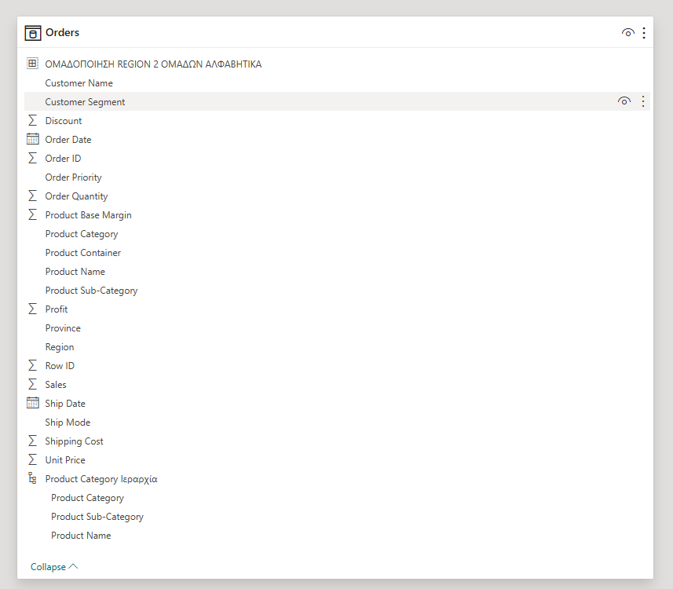
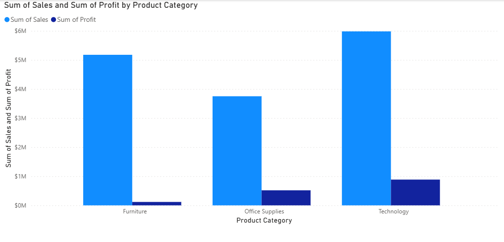
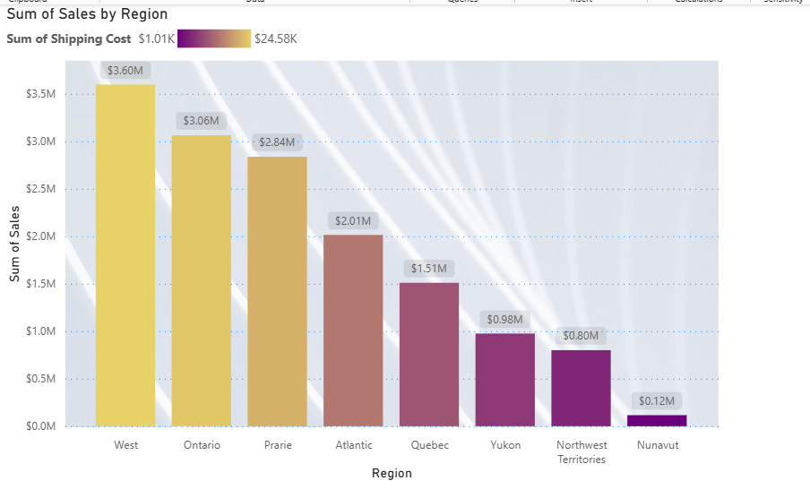
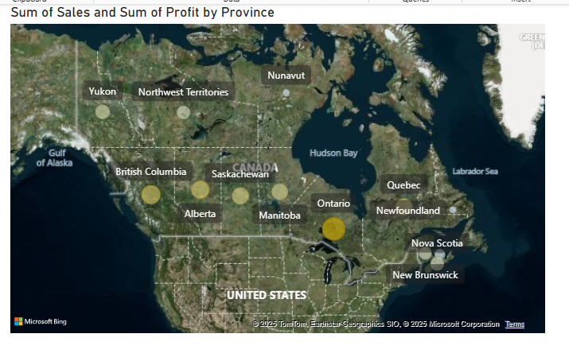

# Product-Region Based Sales Analysis in Power BI

This Power BI Project analyzes sales performance across product categories and regional groupings.  
It leverages dynamic filtering, hierarchical drilldowns, and geospatial visualizations to extract actionable business insights.

---

## 📊 Dataset Overview

The dataset includes sales-related attributes such as:

- Product category, sub-category, and name  
- Regional data: Region, Province  
- Financial metrics: Sales, Profit, Discount, Shipping Cost  
- Date & Customer-related fields  
- Pre-built hierarchies and grouped region logic

---

## 📦 Sales & Profit by Product Category

This bar chart compares the total Sales and Profit across product categories:  
**Technology**, **Furniture**, and **Office Supplies**.

---

## 🌍 Sales by Region with Shipping Cost Coloring

This stacked bar chart shows **Sales by Region**, with **color intensity** representing **Shipping Cost**.

  

---

## 🗺️ Geospatial Visualization

A filled map displays **Sum of Sales** and **Profit** by **Province** using geolocation.

---

## 🗃️ Files

- `ergasia2_final.pbix`: Main Power BI report
- `ergasia2_ok.pbix`, `bi_10_2_24.pbix`: Iterations / previous versions

## 📁 Folder Structure

---

## 📌 Notes

- This project was part of a university assignment (ΕΑΠ).
- Focused on **regional segmentation**, **hierarchical logic**, and **KPI visualization**.

